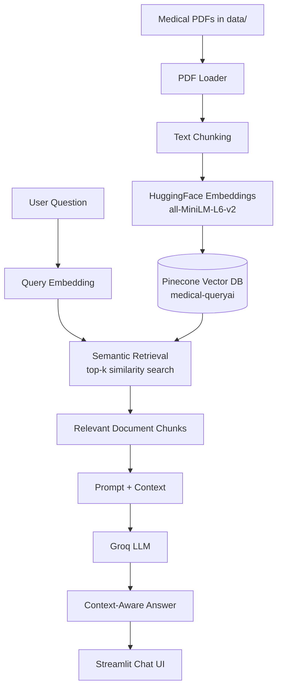

# 🩺 MedQuery AI

**A Retrieval-Augmented Generation (RAG) assistant that answers questions from medical reference documents using LangChain, Pinecone, Groq, and Streamlit.**


---

## ⚠️ Medical Disclaimer

MedQuery AI is an **educational, document-grounded question-answering tool**. It answers only from the medical reference PDFs it has indexed, does **not** diagnose, prescribe, or give personalized medical advice, and is **not a substitute for a qualified healthcare professional**. Always consult a doctor or licensed clinician for medical decisions.

---

## 1. Overview

MedQuery AI lets you ask natural-language questions about a set of medical reference PDFs and get concise, context-grounded answers. It works by embedding the documents into a vector database (Pinecone), retrieving the most relevant chunks for a given question, and asking a Groq-hosted LLM to answer **using only that retrieved context** — reducing hallucination compared to asking a raw LLM.

This is a portfolio-style RAG project demonstrating an end-to-end pipeline: PDF ingestion → chunking → embeddings → vector search → LLM generation → chat UI.

## 2. Features

- 🔍 Context-aware medical Q&A grounded in your own PDF documents
- 📄 Automatic PDF loading, chunking, and embedding
- ⚡ Fast semantic search via Pinecone (serverless, auto-created index)
- 🤖 Groq-hosted LLM for fast, low-latency generation
- 💬 Streamlit chat UI with session history and suggested questions
- 🧩 Optional headless Flask JSON API for programmatic access
- 🔐 No secrets in code — everything via `.env`
- 🙅 Answers "not found in the documents" instead of guessing when context is insufficient

## 3. Demo / Screenshots

_Add a screenshot or GIF of the running Streamlit app here once you have one, e.g. `docs/screenshot.png`._

## 4. Architecture



## 5. RAG Workflow

```
Medical PDFs
    ↓
PDF Loader (PyPDFLoader + DirectoryLoader)
    ↓
Text Chunking (500 chars, 20 overlap)
    ↓
HuggingFace Embeddings (all-MiniLM-L6-v2, 384-dim)
    ↓
Pinecone Vector Database (medical-queryai)
    ↓
User Question → Query Embedding
    ↓
Semantic Retrieval (top-3 similar chunks)
    ↓
Prompt with Retrieved Context
    ↓
Groq LLM (openai/gpt-oss-120b)
    ↓
Context-Aware Answer
    ↓
Streamlit Chat UI
```

If a question can't be answered from the retrieved chunks, the system prompt explicitly instructs the model to say the information wasn't found in the documents rather than inventing an answer.

## 6. Project Structure

```
MedDocAI/
│
├── data/
│   └── Medical_book.pdf        # source medical PDF(s)
│
├── src/
│   ├── __init__.py
│   ├── helper.py                # PDF loading, chunking, embeddings, shared config
│   └── prompt.py                # system prompt for the RAG chain
│
├── research/
│   └── main.ipynb               # original prototyping notebook
│
├── app.py                       # optional Flask JSON API (RAG backend)
├── streamlit.py                 # primary Streamlit chat UI (full RAG pipeline)
├── store_index.py               # indexing script: PDFs → Pinecone
├── requirements.txt
├── setup.py
├── Dockerfile
├── .dockerignore
├── .env.example
├── .gitignore
├── LICENSE
└── README.md
```

## 7. Tech Stack

| Layer            | Technology                                    |
|-------------------|------------------------------------------------|
| Orchestration     | LangChain (`langchain`, `langchain-core`)      |
| Document loading  | `langchain-community` (`PyPDFLoader`)          |
| Embeddings        | `sentence-transformers/all-MiniLM-L6-v2` via `langchain-huggingface` |
| Vector database   | Pinecone (serverless), via `langchain-pinecone` |
| LLM               | Groq (`openai/gpt-oss-120b`), via `langchain-groq` |
| Frontend          | Streamlit                                      |
| Optional API      | Flask                                          |
| Config            | `python-dotenv`                                |
| Language          | Python 3.10                                    |

## 8. How It Works

1. **Ingestion (`store_index.py`)** — loads every PDF in `data/`, splits them into ~500-character overlapping chunks, embeds each chunk with a local HuggingFace sentence-transformer model, and upserts the vectors into a Pinecone index (creating the index automatically if it doesn't exist). Each chunk gets a deterministic ID derived from its source file and content hash, so re-running the script **updates** vectors instead of duplicating the whole dataset.
2. **Retrieval + generation (`streamlit.py` / `app.py`)** — when a user asks a question, it's embedded with the same model, Pinecone returns the top-3 most similar chunks, and those chunks are injected into a system prompt sent to the Groq LLM, which answers using only that context.
3. **UI (`streamlit.py`)** — a chat interface with session history, suggested questions, a sidebar disclaimer, and error handling for missing configuration or a missing index.

## 9. Installation

```bash
git clone <this-repo-url>
cd MedDocAI

conda create -n medicalai python=3.10 -y
conda activate medicalai

pip install -r requirements.txt
```

## 10. Environment Variables

Copy `.env.example` to `.env` and fill in your real keys:

```bash
cp .env.example .env
```

```
PINECONE_API_KEY=your_pinecone_api_key_here
GROQ_API_KEY=your_groq_api_key_here
```

`.env` is listed in `.gitignore` and must never be committed. Only `.env.example` (placeholders only) is tracked.

## 11. Pinecone Setup

1. Create a free account at [pinecone.io](https://www.pinecone.io/) and generate an API key.
2. Put the key in `.env` as `PINECONE_API_KEY`.
3. **You do not need to manually create the index.** `store_index.py` automatically creates a serverless index named `medical-queryai` with dimension `384` (matching `all-MiniLM-L6-v2`) and cosine similarity if it doesn't already exist.

## 12. Groq Setup

1. Create a free account at [console.groq.com](https://console.groq.com/) and generate an API key.
2. Put the key in `.env` as `GROQ_API_KEY`.
3. The model used everywhere in this project (Streamlit, Flask API) is centralized in `src/helper.py` as `GROQ_MODEL_NAME = "openai/gpt-oss-120b"`. This was verified against the live Groq models endpoint at the time of writing — Groq's available model list changes over time, so if you get a "model decommissioned" error, check `client.models.list()` and update this one constant.

## 13. Indexing Medical Documents

Place your medical PDF(s) in `data/`, then run:

```bash
python store_index.py
```

This will:
1. Load and chunk the PDFs
2. Generate embeddings
3. Create the Pinecone index if it doesn't exist
4. Upsert the chunks (safe to re-run — it updates rather than duplicates)

## 14. Running the Application

```bash
streamlit run streamlit.py
```

Open the URL Streamlit prints (typically `http://localhost:8501`).

## 15. Example Questions

- "What is Acromegaly?"
- "What are the symptoms of diabetes?"
- "What is the treatment for hypertension?"
- "What causes migraines?"

Try an off-topic question (e.g. "What is the capital of France?") — the assistant will tell you it isn't in the documents rather than making something up.

## 16. API / Backend (Flask)

`streamlit.py` is fully self-contained and runs the entire RAG pipeline directly — **Flask is not required to use the app.**

`app.py` is a **separate, optional, headless JSON API** exposing the same RAG pipeline for programmatic use (e.g. calling it from another service, script, or mobile app) rather than a human-facing UI:

```bash
python app.py
```

```bash
curl http://localhost:8080/health

curl -X POST http://localhost:8080/ask \
  -H "Content-Type: application/json" \
  -d '{"question": "What is Acromegaly?"}'
```

| Endpoint | Method | Body | Response |
|---|---|---|---|
| `/health` | GET | – | `{"status": "ok"}` or `503` with an error detail if Pinecone/config isn't ready |
| `/ask` | POST | `{"question": "..."}` | `{"answer": "..."}` or a `4xx/5xx` JSON error |

It is not started by Docker by default (Streamlit is the production container's entrypoint) — run it separately if you need the API.

## 17. Docker

The Docker image runs the **Streamlit** app (the primary, working UI) on port `8501`.

```bash
docker build -t meddocai .
docker run --env-file .env -p 8501:8501 meddocai
```

No secrets are baked into the image — `PINECONE_API_KEY` and `GROQ_API_KEY` are supplied at container runtime via `--env-file` or `-e`.

## 18. AWS Deployment

`.github/workflows/cicd.yaml` builds the Docker image, pushes it to Amazon ECR, and (on a self-hosted runner) deploys it to an EC2 instance. This has **not been deployed or tested against real AWS infrastructure** as part of this cleanup — the workflow is logically correct and consistent with the current Groq-based architecture, but you must provision and configure the AWS side yourself:

**Required AWS resources:**
- An ECR repository to store the Docker image
- An EC2 instance (Ubuntu) with Docker installed, registered as a GitHub Actions **self-hosted runner**
- An IAM user/role with `AmazonEC2ContainerRegistryFullAccess` and `AmazonEC2FullAccess` (or narrower equivalents)

**Required GitHub Secrets** (Settings → Secrets and variables → Actions):

| Secret | Purpose |
|---|---|
| `AWS_ACCESS_KEY_ID` | IAM credentials for ECR login |
| `AWS_SECRET_ACCESS_KEY` | IAM credentials for ECR login |
| `AWS_DEFAULT_REGION` | AWS region, e.g. `us-east-1` |
| `ECR_REPO` | Your ECR repository name |
| `PINECONE_API_KEY` | Passed into the running container |
| `GROQ_API_KEY` | Passed into the running container |

**Manual setup steps** (once, on the EC2 instance):

```bash
sudo apt-get update -y && sudo apt-get upgrade -y
curl -fsSL https://get.docker.com -o get-docker.sh
sudo sh get-docker.sh
sudo usermod -aG docker ubuntu
newgrp docker
```

Then register the instance as a self-hosted runner under **Settings → Actions → Runners → New self-hosted runner** and follow GitHub's generated commands.

## 19. CI/CD

The pipeline has two jobs:
1. **Continuous-Integration** — builds the Docker image and pushes it to ECR.
2. **Continuous-Deployment** — runs on the self-hosted EC2 runner, pulls the new image, and restarts the container with `PINECONE_API_KEY` and `GROQ_API_KEY` injected as environment variables (never hardcoded).

## 20. Security

- No API keys, passwords, or credentials are hardcoded anywhere in source code.
- `.env` is gitignored and was never committed (verified against git history).
- `.env.example` contains placeholders only.
- Errors shown to end users are friendly, generic messages — raw exceptions/tracebacks are logged server-side only, never surfaced to the UI or API response.
- Chat messages are HTML-escaped before rendering in Streamlit to prevent script injection via user input.
- Docker images never bake in secrets; they're injected at runtime.

## 21. Medical Disclaimer

See the top of this README. This tool is for educational and informational purposes only and is not a substitute for professional medical advice, diagnosis, or treatment.

## 22. Limitations

- Answer quality depends entirely on what's in the indexed PDFs — it cannot answer questions outside that corpus.
- The embedding model (`all-MiniLM-L6-v2`) is small and fast but less accurate than larger embedding models.
- No authentication/rate-limiting on the Flask API — add these before exposing it publicly.
- AWS/EC2 deployment path is configured but not live-tested in this environment.

## 23. Future Improvements

- Add conversation-aware (multi-turn) retrieval instead of single-question retrieval.
- Add source citations (page numbers) alongside answers.
- Add automated tests and a CI test job.
- Add authentication and rate limiting to the Flask API.
- Support uploading new PDFs from the UI.

## 24. Contributing

Issues and pull requests are welcome. Please don't commit real API keys or secrets in any contribution.

## 25. License

Distributed under the [MIT License](LICENSE).

## 26. Author

Built as a portfolio project demonstrating a production-style RAG pipeline (LangChain + Pinecone + Groq + Streamlit).

---

## Key Technical Concepts

- **RAG (Retrieval-Augmented Generation):** instead of relying solely on what an LLM "knows," relevant documents are retrieved at query time and fed to the model as context, grounding its answer in real source material.
- **Embeddings:** numerical vector representations of text such that semantically similar text ends up close together in vector space.
- **Vector Database:** a database (Pinecone here) optimized for storing embeddings and performing fast similarity search over millions of vectors.
- **Semantic Search:** finding text by meaning rather than exact keyword match, using embedding similarity (cosine distance here).
- **Chunking:** splitting long documents into smaller overlapping pieces so each piece fits within the embedding/LLM context window and retrieval is more precise.
- **Retrieval:** the step of fetching the top-k most similar chunks to a query embedding from the vector database.
- **Prompt Engineering:** designing the instructions given to the LLM (here, "answer only from this context, say so if you don't know") to control its behavior and reduce hallucination.
- **LLM (Large Language Model):** the generative model (Groq-hosted `openai/gpt-oss-120b` here) that produces the final natural-language answer.
- **Streamlit:** a Python framework for building interactive data/web apps quickly, used here for the chat UI.
- **Pinecone:** a managed, serverless vector database used to store and query document embeddings.
- **Groq:** an inference platform providing very low-latency hosted LLM inference, used here for answer generation.

## How to Explain This Project in an Interview

"MedQuery AI is a RAG-based question-answering system over medical reference documents. I load PDFs, split them into overlapping chunks, embed each chunk with a sentence-transformer model, and store the vectors in a Pinecone index. When a user asks a question, I embed the question the same way, retrieve the top-k most similar chunks from Pinecone, and pass them as context into a prompt sent to a Groq-hosted LLM — so the model answers using the retrieved evidence instead of purely from its own training data, which reduces hallucination. If nothing relevant is retrieved, the prompt instructs the model to say the information isn't in the documents rather than guessing. The whole pipeline is exposed through a Streamlit chat UI, plus an optional Flask JSON API for programmatic access. It's a clean example of the standard RAG architecture: ingestion, chunking, embedding, vector search, and grounded generation."
